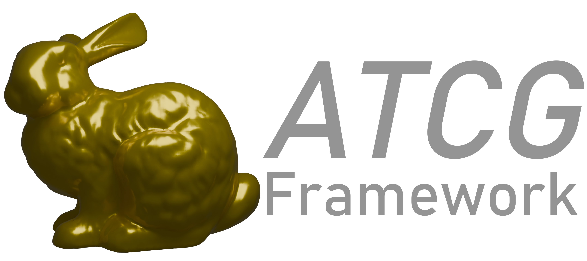

<p align="left">

</p>

----

This repository contains a C++ 3D rendering framework for research applications and scientific computation/visualization. It combines the OpenGL rendering pipeline with high performance CUDA integration using torch.

## Building

This framework is primarily tested on Windows using MSVC. For Linux, gcc is recommended. Additional dependencies needed for building the project are [CMake>=3.27](https://cmake.org), [Python>=3.9](https://www.python.org), [CUDA>=12.1](https://developer.nvidia.com/cuda-toolkit), and [pytorch2.4.0](https://pytorch.org) with the same CUDA version as your global CUDA installation.

After installing the dependencies, clone the repository recursively (to include submodules)

```
git clone --recursive https://grossglockner.cs.uni-bonn.de/zingsheim/atcg_framework.git
```

If you already cloned the repository without recursive cloning, run

```
git submodule update --init --recursive
```

Navigate to the project folder and create and run the following command to setup the project.

```
cmake . -B build
```

From the main folder of this project (aka the folder where this file is located), run

```
cmake --build build --parallel --config <Debug|Release>
```

to compile the project.

### Building with CUDA Support

Per default the project is built with CUDA support enabled. You can disable this behavior by disabling the ATCG_CUDA_BACKEND option

```
cmake . -B build -DATCG_CUDA_BACKEND=OFF
```
If CUDA is not used, you should also use a pytorch version without CUDA.

### Build python bindings

The project come with python bindings which can be install via
```
pip install -e .
```
it requires [charonload](https://github.com/vc-bonn/charonload) as additional dependency. Per default, it is built with CUDA backend.

### Building the documentation

The documentation can be built using [doxygen](https://www.doxygen.nl/index.html) and [sphinx](https://www.sphinx-doc.org/en/master/). Install the following dependencies using pip

```
pip install sphinx furo breathe myst_parser
```

and set the `ATCG_BUILD_DOCS` option to `ON` when generating the CMake project.

### Building tests (experimental)

To build the unit tests, set the `ATCG_BUILD_TESTS` option to true.

```
cmake . -B build -DATCG_BUILD_TESTS=On
```

Run the `atcg_lib_test` target to run the tests.

## Project Structure

The code base is based on the [Hazel Game Engine](https://github.com/TheCherno/Hazel). The framework also includes several dependencies that are used to implement different computer graphics algorithms.
The project consists of the following components:

-**atcg_lib**: This library handles the rendering and event handling of the application. It defines an entry point for each application that uses this library. Each executable uses this entry point to build its application.

-**src**: Contains the targets for each executable. See _Usage_ for more details on its structure.

-**shader**: Contains the opengl shaders used for rendering. You can add custom shaders by providing a vertex (`<name>.vs`), fragment (`<name>.fs`), and (optionally) a geometry (`<name>.gs`) shader. To use them in a project you have to add it via

```c++
atcg::ShaderManager::addShader("<name>");
```

and use it by

```c++
atcg::ShaderManager::getShader("<name>");
```

You can edit shaders while the program is running!

-**res**: Contains resources (meshes and textures)

-**external**: Contains the exernal libraries used in this framework. There is no need to install any external libraries (except for OpenGL/Driver and torch) as all dependencies come with this repository.

-**python**: Contains the python bindings.

-**tests**: Contains the tests.

-**docs**: Contains the documentation.

## Usage

All exercises have the same structure, that is rougly outlined here. More examples can be found in `src`.

```c++
#include <Core/EntryPoint.h>
#include <ATCG.h>

//This class holds the methods that are called by the framework internally
class MyLayer : public atcg::Layer
{
public:

    MyLayer(const std::string& name) : atcg::Layer(name) {}

    // This is run at the start of the program
    virtual void onAttach() override
    {
        //Initialize members, etc.
        // ...

        // Load meshes
        mesh = atcg::IO::read_mesh("path/to/mesh");

        // Load images and create textures
        diffuse_image = atcg::IO::imread("path/to/image");
        diffuse_texture = atcg::Texture2D::create(diffuse_image);

        // Create a scene using the custom shared pointer atcg::ref_ptr
        scene = atcg::make_ref<atcg::Scene>();

        // Create an entity inside the scene
        atcg::Entity entity = scene->createEntity("Entity Name");

        // Add components to entity and edit them
        entity.addComponent<atcg::TransformComponent>();
        entity.addComponent<atcg::GeometryComponent>(mesh);
        auto& renderer = entity.addComponent<atcg::MeshRenderComponent>();
        renderer.material.setDiffuseTexture(diffuse_texture);
        renderer.material.setMetallic(0.5f);

        //...
    }

    // This gets called each frame
    virtual void onUpdate(float delta_time) override
    {
        camera_controller->onUpdate(delta_time);

        //Any physics based updates and rendering is handled here

        //...
        atcg::Renderer::draw(scene, camera_controller->getCamera());
    }

    //All draw calls to ImGui to create a user interface
    virtual void onImGuiRender() override
    {
        ImGui::BeginMainMenuBar();

        if(ImGui::BeginMenu("Rendering"))
        {
            ImGui::MenuItem("Show Render Settings", nullptr, &show_render_settings);

            ImGui::EndMenu();
        }

        ImGui::EndMainMenuBar();

        if(show_render_settings)
        {
            ImGui::Begin("Settings", &show_render_settings);

            // Set some settings

            ImGui::End();
        }

    }

    // This function is evaluated if an event (key, mouse, resize events, etc.) are triggered
    virtual void onEvent(atcg::Event& event) override
    {
        camera_controller->onEvent(event);

        atcg::EventDispatcher dispatcher(event);

        //Add a custom function that gets called when an event is triggered
        dispatcher.dispatch<atcg::MouseClickedEvent>(ATCG_BIND_EVENT_FN(MyLayer::onMouseClicked));
    }

    bool onMouseClicked(atcg::MouseClickedEvent& event)
    {
        //Do something if the mouse is clicked
    }

private:
    atcg::ref_ptr<atcg::Scene> scene;
    atcg::ref_ptr<atcg::CameraController> camera_controller;
    atcg::ref_ptr<atcg::Mesh> mesh;

    atcg::ref_ptr<atcg::Image> diffuse_image;
    atcg::ref_ptr<atcg::Texture2D> diffuse_texture;

    bool show_render_settings = false;
};

class MyApplication : public atcg::Application
{
    public:

    MyApplication()
        :atcg::Application()
    {
        pushLayer(new MyLayer("Layer"));
    }

    ~MyApplication() {}

};

//Entry point of the app
atcg::Application* atcg::createApplication()
{
    return new MyApplication;
}
```

### Custom shared pointers

The framework internally uses a custom shared pointer implementation that is very similar to the STL shared_ptr architecture (although not all std::shared_ptr features are implemented):

```c++
atcg::ref_ptr<T> p = atcg::make_ref<T>(...);
p->foo();
T* raw = p.get();
```

This implementation is used to implement CUDA shared pointers (if enabled) and can be used like:

```c++
atcg::dref_ptr<T> p;
```

This shared pointer acts as a standard std::shared_ptr but handles CUDA device memory (i.e. the memory is freed if the internal references count reaches zero).

**IMPORTANT**: Note that CUDAs memory API is more a C than C++ API. Therefore object construction works a bit differently. Do NOT use atcg::make_shared when constructing a device ptr but use the given constructors. To initialize an object correctly, you have to copy it from host.

```c++
// Creates a device buffer with 10 ints
atcg::DeviceBuffer<int> p(10);

// ...

// Creates an object and initializes it from a host object
T host_object(...);
// atcg::dref_ptr as shortcut for atcg::ref_ptr<..., atcg::device_allocator>
atcg::dref_ptr<T> device_ptr;
device_ptr.upload(&host_object);
```

## Torch API

Many (OpenGL) objects offer torch interfaces to handle device memory. This allows for efficient manipulation of device buffers with host-device memory uploads. For example, for meshes:

```c++
auto positions = graph->getPositions(atcg::GPU); // Get a direct pointer to OpenGL buffer
auto colors    = graph->getDeviceColors();
auto normals   = graph->getHostNormals(); // Map OpenGL buffer to host memory (requires copy)
```

When mapping OpenGL buffers to CUDA, one has to make sure that the memory is unmapped before any further OpenGL operations use this memory. This can be done using the `graph->unamp<Device|Host|All>Pointer()` methods.

There is also a CUDA API for textures. However, because textures work differently to standard memory buffers, it is not possible to retreive a simple pointer to the memory addresses but the texture is binded to a `cudaArray_t` objet. This can be converted to a `cudaTextureObject_t` or `cudaSurfaceObject_t` to read or write to texture memory in CUDA kernels. Texture data can also be retreived/set using torch tensors. In this case (for 1 and 4 channel textures), the texture data is uploaded using a device-device copy.

## Dependencies (included)

- [OpenMesh](https://gitlab.vci.rwth-aachen.de:9000/OpenMesh/OpenMesh) - For mesh manipulation.
- [Glad](https://glad.dav1d.de) - For loading OpenGL.
- [ImGui](https://github.com/ocornut/imgui) - For interactive GUI.
- [ImGuizmo](https://github.com/CedricGuillemet/ImGuizmo) - For guizmos.
- [ImPlot](https://github.com/epezent/implot) - For plots.
- [GLFW](https://github.com/glfw/glfw) - For window creation and handling
- [GLM](https://github.com/g-truc/glm) - For OpenGL math.
- [entt](https://github.com/skypjack/entt) - For the entity component system.
- [nanoflann](https://github.com/jlblancoc/nanoflann) - For kD-Trees.
- [nanort](https://github.com/lighttransport/nanort) - For ray - mesh intersection tests.
- [protable-file-dialogs](https://github.com/samhocevar/portable-file-dialogs) - For file dialogs.
- [spdlog](https://github.com/gabime/spdlog) - For logging.
- [stbimage](https://github.com/nothings/stb) - For image I/O.
- [tinyobjloader](https://github.com/tinyobjloader/tinyobjloader) - For loading obj meshes.
- [json](https://github.com/nlohmann/json) - For serializing JSON files.
- [charonload_cpp](https://github.com/nlohmann/json) - For torch integration. This needs to be installed via pip if you want to use python bindings.
- [openvr](https://github.com/ValveSoftware/openvr) - For VR support.
- [googletest](https://github.com/google/googletest) - For testing.
- [sfml](https://github.com/SFML/SFML) - For networking. (*Note: Might require additional dependencies on Linux, see SFML repositoriy.*) 
